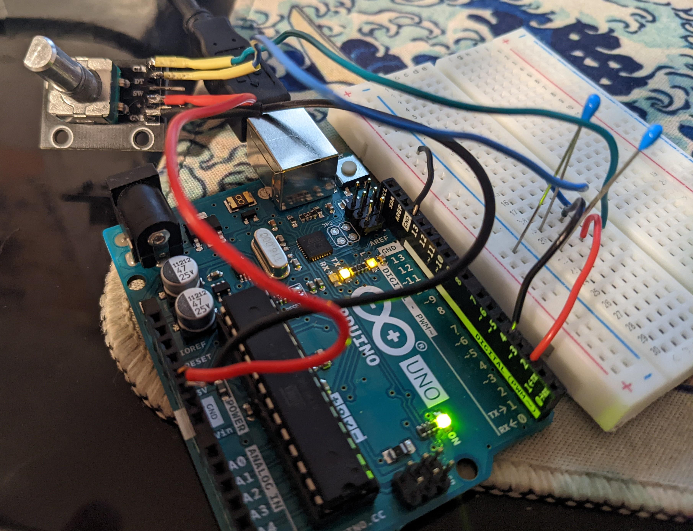
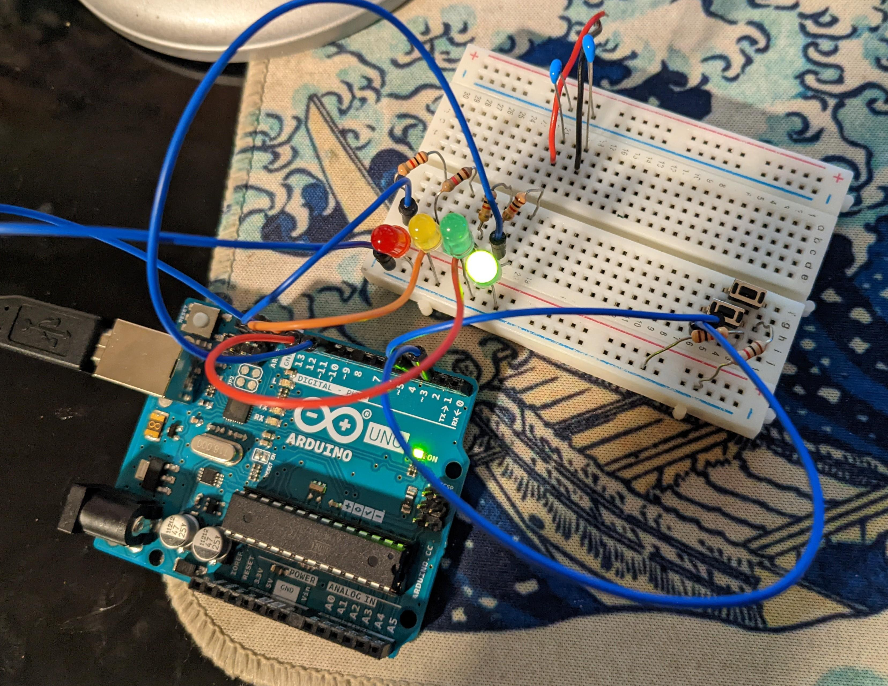

# Arduino Intro Assignment 1

A series of exercises designed to build familiarity with the Arduino.

# Rotary Encoder

Arduino program to read the position of a rotary encoder by counting
along its tracks. Clockwise movements are designed to be positive, while
counterclockwise movements are negative.

## Wiring

The rotary encoder has + connected to 5V on the Arduino, and GND to GND. 

Pin A (CLK) is connected to digital pin 2 (with interrupts), with a ~1nF capacitor from CLK to GND.
Pin B (DT) is connected to digital pin 4, with another ~1nF capacitor from DT to GND. These capacitors help
to filter any bouncing in the encoder, smoothing the response. 

## Programming

Open `rotary_encoder/rotary_encoder.ino` in the Arduino IDE. After wiring and plugging in your Arduino,
configure the IDE to the correct port, and select 'Upload' to program. Verify the program functions with the
'Serial Monitor'.

# LED Strobe

## Wiring

Each LED is connected from a digital pin (pins 10-13), to ground
through a resistor. This allows the LEDs to be "active high".

The buttons are similarly connected to a digital pin (pins 2,3) with
interrupts, to ground through a resistor. These are configured as
INPUT_PULLUPs, making them "active low".

## Programming

Open `led_strobe/led_strobe.ino` in the Arduino IDE. After wiring and plugging in your Arduino,
configure the IDE to the correct port, and select 'Upload' to program. Verify the program functions with the
'Serial Monitor'.
